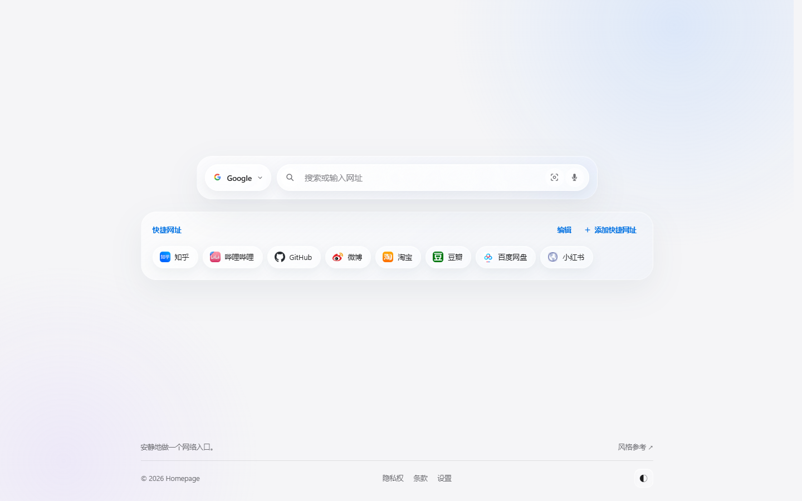
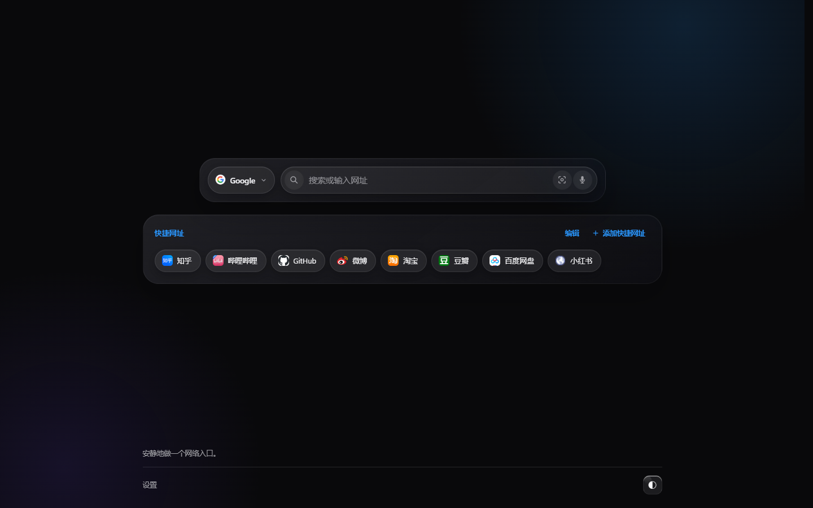
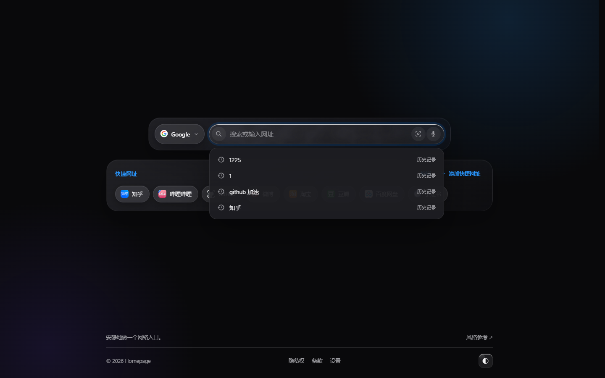
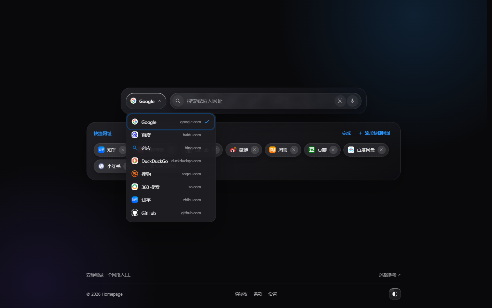
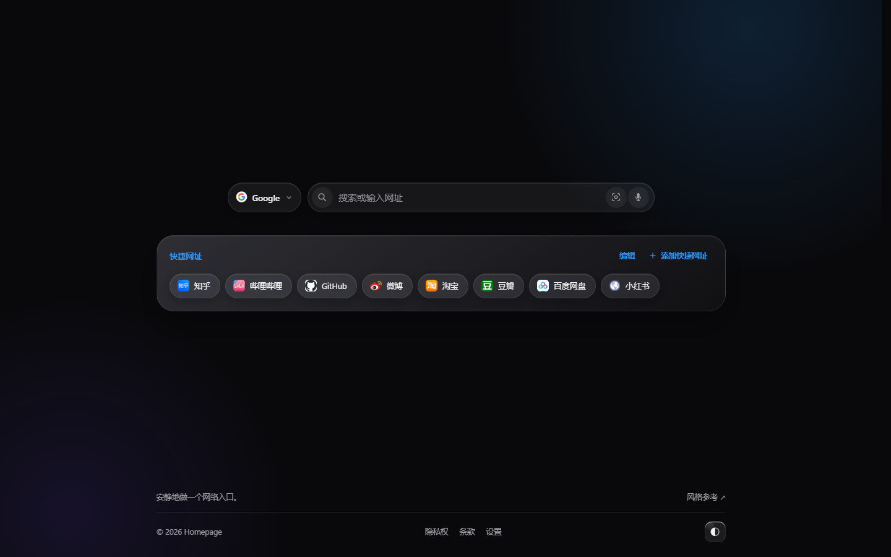
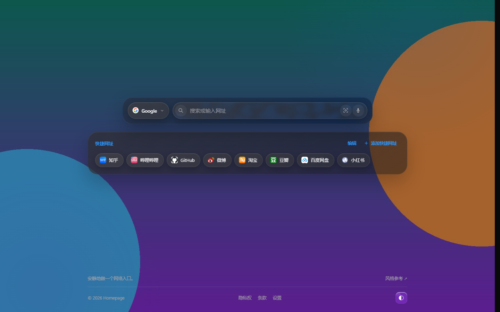
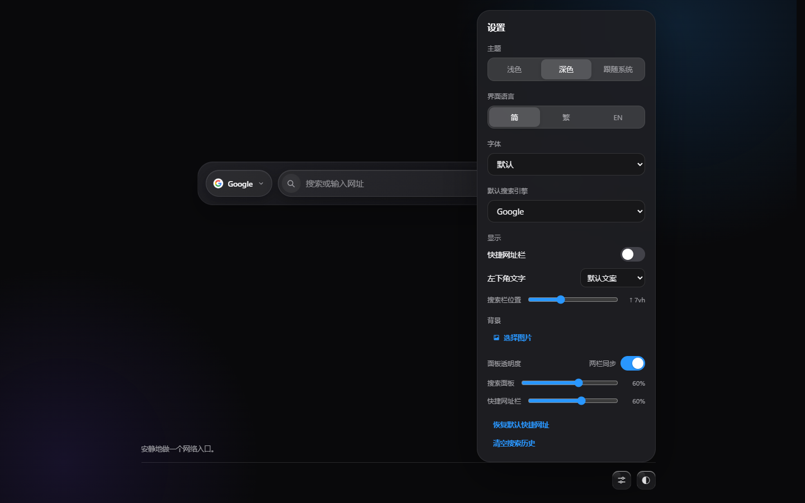

# Homepage — 极简搜索页 · Liquid Glass 风格

> **隐私声明：无后台联网、无数据上传。** 本项目不会在后台主动联网，也不会把本地背景图片、页面搜索记录或浏览器历史上传到开发者服务器。搜索跳转、搜索联想和网站图标属于用户主动使用的功能，可能直接访问用户选定的搜索引擎或图标服务；关闭这些功能或断网后，页面仍可使用本地设置和本地记录。

> **加州隐私法说明：** 按当前实现，本项目遵循数据最小化、目的限定、用户选择和透明告知的设计，可作为面向加州用户的 CCPA/CPRA 隐私实践声明基础。项目不销售或共享个人信息，不建立开发者侧用户画像，也不收集姓名、邮箱、账号等身份信息。但这不是法律意见；正式发布前仍应由合格律师审阅。

> **Firefox 条例说明：** 新标签页覆盖在安装清单中声明，首次打开会先向用户说明用途并询问是否继续使用；浏览器历史记录是可选权限，只有用户在设置中主动点击并通过 Firefox 权限确认后才会读取。扩展不会修改或删除历史记录。

纯原生 **HTML + CSS + JavaScript**，零依赖、零构建：双击 `index.html` 即可使用，也可以作为 Chrome / Edge 新标签页扩展直接安装。扩展名称为 **Homepage**。

## 安装为浏览器主页插件

1. 打开 Chrome 或 Edge 的扩展管理页：Chrome 输入 `chrome://extensions`，Edge 输入 `edge://extensions`。
2. 开启右上角的「开发者模式」。
3. 点击「加载已解压的扩展程序」，选择本项目文件夹 `MyNewTab-main`。
4. 新建标签页会自动使用这个主页；修改文件后，在扩展管理页点击扩展卡片上的刷新按钮即可生效。

联想提示会按当前搜索引擎请求其公开的建议接口。请求失败、浏览器离线或接口暂时不可用时，会自动回退到搜索历史和本地提示；搜索本身仍然正常工作。插件没有后台联网任务。

背景图片必须由用户在设置中点击「上传背景图片」并选择文件，图片会压缩后保存在扩展页面的本地存储中，不会上传到服务器。首次打开时会显示新标签页覆盖和数据使用说明；浏览器浏览记录属于可选权限，只有在设置中点击「允许读取浏览记录」并通过浏览器权限确认后才会用于搜索建议。扩展不会修改或删除浏览记录。

Firefox 使用同一个 `manifest.json` 和 `chrome_url_overrides.newtab` 配置。项目同时提供 `Homepage-Liquid-Glass.xpi`，可在 Firefox 的「调试附加组件」页面临时加载。普通 Firefox 安装通常要求扩展经过 Mozilla 签名；未签名 XPI 不能在正式版 Firefox 中永久安装。

Chrome / Chromium 使用 `Homepage.crx`。CRX 使用本地生成的临时密钥打包，私钥不随项目发布；Chrome 仍可能要求开发者模式或从 Chrome Web Store 安装。Firefox、Chrome 和 Edge 都会在新标签页页面第一次打开时询问是否继续使用，不会由网页静默修改浏览器设置。

界面风格参考 [lpxlpx7/jurinas-website](https://github.com/lpxlpx7/jurinas-website)（线上站 <https://www.lpxlpx7.top/>）：
Apple 式的液态玻璃质感、`#f5f5f7` 底色加蓝色光晕、玻璃胶囊控件与圆角面板。

页面只有一个搜索框和一个快捷网址栏，垂直居中；没有顶栏、没有大标题、没有搜索按钮（回车即搜）。




首次安装并打开新标签页时会询问是否使用此页面；点击「暂不同意」会恢复安装前保存在本地的页面设置。扩展不能读取或修改 Firefox/Chrome 的浏览器首页地址，因此首页状态需要用户在浏览器设置中手动确认；页面会透明标注这一限制。每次打开新标签页都会确认当前扩展覆盖仍在生效。浏览器浏览记录属于可选权限，只有在设置中点击「允许读取浏览记录」并通过浏览器权限确认后才会用于搜索建议，最多显示 4 条，扩展不会修改或删除浏览记录。

## 功能

- **搜索框 + 搜索引擎切换框**：搜索框左侧的玻璃胶囊可在 8 个引擎之间切换
  （Google / 百度 / 必应 / DuckDuckGo / 搜狗 / 360 搜索 / 知乎 / GitHub），选择会记住。
  下拉打开后，点页面任意空白处、点搜索框、或按 `Esc` 都能收起。
- **快捷网址栏**：搜索框下方的玻璃面板，默认 8 个常用站点；
  支持 **添加 / 删除 / 拖动排序 / 双击编辑**，数据存在浏览器本地；可在设置里整栏关闭。
  关掉之后，设置里会多出一个 **「搜索栏位置」** 滑块，可以在整个可用区域里把搜索栏上下挪
  （上限按窗口高度动态计算，推到两端也不会压到页脚），免得整块内容孤零零挂在正中间。
  图标取不到时逐个淡入（先备用服务、再退成首字母色块），不会出现一排空方块。
- **智能输入**：输入 `github.com` 这类网址直接跳转，输入关键词则交给当前引擎搜索。
- **搜索建议**：聚焦输入框会给出历史记录、打开网址、在当前引擎中搜索，并尝试从当前搜索引擎获取实时联想词；支持 ↑ ↓ 选择、Enter 确认、Esc 关闭；下拉框会盖在下面的网址面板之上。

  
  

- **面板透明度**：设置里两个滑块，分别是搜索面板和快捷网址栏的不透明度（0–100%）。
  滑块同时控制三件事：底色浓度、边框与投影、**背景磨砂的强度** —— 越透明磨砂越弱，
  拉到 0% 时面板完全消失、后面的背景图原样透出来（不加任何模糊）。
  相反方向拉满则是厚重的磨砂玻璃。设过的值会在下次打开时直接生效（由 `preload.js`
  在首屏前写入，不会先闪一下默认值）。
  标题右边的 **「两栏同步」** 开关打开后，拖任意一个滑块另一个都跟着走（打开时以搜索面板的值对齐）；
  关掉则各调各的。

  

- **自定义背景**：设置里点击「上传背景图片」，或直接把图片拖到页面上。图片会先缩到 1920px 再存进
  浏览器本地；配一个「淡化」滑块控制薄纱浓度，随时可「清除背景」。
  有背景图时面板默认更实一些（75%），可以在透明度里再调。

  

- **深色 / 浅色 / 跟随系统**：页脚右侧的 `◐` 快速切换，或在设置面板里三选一。
- **页面字体**：设置里可切换 默认 / 圆润 / 衬线 / 等宽。
  「圆润」需要系统装了 SF Pro Rounded、圆体、幼圆一类的圆体字，没装就回退到系统黑体（差别不大）。
- **页脚小挂件**：默认文案 / **每日一言** / **今天吃什么**，在设置里切换（显示在页脚右上角）。
  后两者每天自动换一条（按日期取模），「今天吃什么」点一下还能当场换一个。
- **多语言界面**：设置里的玻璃分段控件切换 简体中文 / 繁體中文 / English。
- **语音搜索**：浏览器支持 Web Speech API 时麦克风按钮可用。
- **以图搜图**：相机按钮切换图片搜索模式（该引擎不支持时会提示）。
- **设置面板**（页脚右下角、和 `◐` 并排的那个玻璃按钮）：主题、界面语言、字体、默认搜索引擎、
  快捷网址栏开关、页脚文字、搜索栏位置（隐藏网址栏时出现）、背景、面板透明度、
  恢复默认快捷网址、清空搜索历史、按需允许或关闭浏览器历史记录建议。

  

## 快捷键

| 按键 | 作用 |
| --- | --- |
| `/` | 聚焦搜索框 |
| `Enter` | 搜索（`Ctrl` / `Cmd` + 点击放大镜 = 新标签页打开） |
| `↑` `↓` | 在搜索建议中移动 |
| `Esc` | 关闭建议 / 下拉菜单 / 对话框 |

## 文件结构

```
index.html        页面结构（搜索面板 · 快捷网址面板 · 页脚 · 设置面板 · 对话框）
styles.css        设计变量、玻璃质感、布局与响应式
preload.js        首屏同步脚本：第一次绘制前就应用已保存的主题/字体/背景/面板透明度
liquid-glass.js   注入液态玻璃用的 SVG 滤镜（feTurbulence + feDisplacementMap）
app.js            引擎切换、搜索、快捷网址、设置、背景、多语言
manifest.json     Chrome / Edge / Firefox 扩展清单，名称为 Homepage
icons/            Homepage 搜索图标（16 / 32 / 48 / 128）
```

## 首屏不闪（preload.js）

`app.js` 是 `defer` 的，要等 HTML 解析完才执行。如果只靠它应用设置，页面会先按 CSS 的
默认值（跟随系统主题、面板 60%）画一帧，再跳到你保存的值 —— 也就是"闪一下"。

所以 `<head>` 里有一个同步执行的 `preload.js`（参考站的 `theme-init.js` 也是这个思路），
它在首次绘制之前就把 `localStorage` 里的外观写进 `<html>`：

```html
<link rel="stylesheet" href="styles.css">
<script src="preload.js"></script>   <!-- 无 defer，阻塞解析但只有几百字节 -->
```

写 DOM 的动作（`HP.applyTheme / applyFont / applyBackground / applyOpacity`）只在这一份实现里，
`app.js` 负责状态与界面同步，然后调用同样的 `HP.*`，两边规则不会走偏。

## 入场动画

上下两个框**同时开始、时长一致**（各 1800ms），分两层做：

```css
/* 玻璃框：只做位移。transform 不是 backdrop root 的触发条件，磨砂全程有效 */
.search-card,
.shortcuts-panel {
  animation: panel-rise 1800ms cubic-bezier(.2, .8, .2, 1) both;    /* translateY(16px) → 0 */
}

/* 框里的内容：只做淡入。位移已经在框那层做了，两层都加会叠成 32px */
.search-card .search-row,
.panel-head,
.shortcut-list {
  animation: content-fade 1800ms cubic-bezier(.2, .8, .2, 1) both;  /* opacity 0 → 1 */
}
```

两个框都在加载时立即开始，所以时间线完全对齐（可以用 `document.getAnimations()` 核对
`startTime` 是否相同）。想更快/更慢，**两处的 `1800ms` 要一起改**，否则两个框就对不齐了。

### 为什么玻璃框不能"淡入"

`opacity < 1` 会让元素成为 **backdrop root**，面板里的 `backdrop-filter` 就采不到背后的画面。
表现是：整个淡入过程中磨砂是"关着"的，等动画结束 opacity 回到 1，磨砂才"啪"地出现 —— 很突兀。
`filter` / `mask` / `clip-path` 也是同样的效果。

**`transform` 不在这个名单里**，所以玻璃框可以滑动入场，而磨砂从第一帧就是好的。
换句话说：玻璃元素可以移动、可以缩放，但别用透明度淡入淡出。

### 图标是各自淡入的

favicon 要联网取，所以每张图加载成功时才加 `.is-loaded` 淡入（默认 `opacity: 0`），
这样不会出现"先看到一排空方块、图标再突然蹦出来"：

```css
.chip__icon img, .engine__icon-wrap img, .engine__logo img { opacity: 0; transition: opacity 320ms ease; }
.chip__icon img.is-loaded, .engine__icon-wrap img.is-loaded, .engine__logo img.is-loaded { opacity: 1; }
```

取不到就用备用服务，再取不到则换成首字母色块（色块不需要淡入，直接显示）。
因为这些都只是普通 ``，整个入场动画**不需要 JS 参与**，也就没有"等图标加载完再触发"那类时序问题
（曾经试过用 rAF 延迟加 class，但后台标签页会挂起 rAF，面板就一直不出来）。

`prefers-reduced-motion: reduce` 时不做动画、直接显示。

## 液态玻璃是怎么做的

三层叠加，缺一不可：

1. **渐变底色 + 内高光**：半透明白/黑渐变、`inset 0 1px 0 rgba(255,255,255,…)` 勾出边缘反光；
2. **背景模糊**：`backdrop-filter: blur(28px) saturate(185%)`，让下层内容变成磨砂；
3. **SVG 滤镜折射**：`liquid-glass.js` 注入 `#panel-lens`（面板镜头）与 `#control-glass`（控件），
   CSS 用 `@supports (backdrop-filter: url("#panel-lens"))` 选用。

不支持第 3 步的浏览器会停在磨砂玻璃效果，不会报错也不会掉样式。

## 自定义

- **换搜索引擎**：改 `app.js` 顶部的 `ENGINES`，`search` / `images` 用 `%s` 占位查询词。
- **换默认快捷网址**：改 `DEFAULT_LINKS`（或在设置面板点"恢复默认快捷网址"）。
- **换配色**：`styles.css` 顶部的 `:root` 与 `[data-theme="dark"]` 变量
  （`--page` / `--ink` / `--blue` / `--glass*` / `--radius-*`）。
- **改整体大小**：`.shell` 控制整页宽度，`.search-card` 的 `max-width` 控制搜索面板宽度，
  搜索框/胶囊的高度在 `.search-field`、`.engine__trigger`、`.chip` 里。

## 隐私与合规

- **联网声明**：扩展无后台网络任务。用户主动输入并提交搜索时会跳转到所选搜索引擎；输入时的实时推荐会请求所选引擎的公开建议接口；快捷网址和搜索引擎图标可能请求 favicon 服务。
- **本地数据**：主题、引擎、快捷网址、页面搜索记录、语言和背景图片使用浏览器本地存储。背景图片经本地压缩后保存，不上传。
- **浏览器历史**：默认关闭。用户必须在设置中主动开启，并通过 Firefox/浏览器的可选 `history` 权限确认；仅用于搜索建议，不修改、不删除、不上传。
- **第三方服务**：搜索、建议和 favicon 请求会直接发送到对应第三方服务，其处理方式受对应服务自己的隐私政策约束。本项目不代理这些请求，也不保存其返回内容。
- **加州用户**：本项目当前实现不销售或共享个人信息，不提供开发者侧广告画像，也不建立开发者侧账户或个人资料。若发行者未来增加分析、广告、账号或服务器功能，必须重新评估 CCPA/CPRA 义务并更新声明。
- **法律状态**：以上是基于当前代码行为的工程说明，不是法律意见，也不等同于政府或 Mozilla 的认证。
- **Google/Chrome 隐私说明**：本扩展使用 Chrome Manifest V3、`chrome_url_overrides.newtab` 和可选 `history` 权限；不使用后台服务、不上传本地数据、不出售或共享个人信息。Chrome Web Store 的最终审核、隐私披露和开发者账户义务仍由 Google 审核规则决定，本项目不声称获得 Google 官方认证。

## 开源协议

本项目使用 [MIT License](LICENSE)。

## 说明

- 参考站自带了 SF Pro 字体文件，本项目**没有**打包（Apple 字体不便再分发），
  改用系统字体栈：macOS 上自动是 SF Pro，Windows 上是 Segoe UI，观感一致。
  想要完全一致的话，把参考站的 `fort/` 目录拷过来，再照 `styles.css` 顶部加 `@font-face` 即可。
- 快捷网址图标走 Google 的 favicon 服务，失败时回退到 DuckDuckGo，再失败则显示首字母色块；离线也能看。
- 所有本地数据（主题、引擎、快捷网址、页面搜索记录、语言、背景图）都只存在浏览器 `localStorage`，不上传开发者服务器。
  背景图会压到 1920px / JPEG，仍可能占用几百 KB 配额；存不下时会提示换一张小图。
